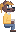

    

        
    

---

> ### Take Orders, Brew Coffee, Serve Customers, Earn Money
> 
> In this tycoon-like game, that's the task of a young anthropomorphic canine called Knox Janáček who moved to Raudsborough.
> You, the player, will play as him and help him reaching the goal of running his own café.
> 
> Will you manage to help him reach his goal, or will you cause him to lose his chance?

---

## Play the Game
[Twelve Months: Hundred Cups of Tin](https://decodinginspire9211.github.io/HundredCupsOfTin-JS)

## Scenes
### **Main Menu**

    

        
        
<b>Main Menu</b>

    

### **Ingame**

    

        
        
<b>Ingame Scene</b>

    

## Audio
### **Main Theme**
[tmhcot_theme_nes.ogg](src/components/audio/tmhcot_theme_nes.ogg)

### **Ingame Theme**
[tmhcot_theme_nes.ogg](src/components/audio/tmhcot_nes_ingame.ogg)

## Sprites / Spritesheets
Below are the sprites and spritesheets used in the game.

### **The Player - Knox Janáček**

    

        
        
<b>Animated Profile Window</b>

    

    

        
        
<b>Knox Janáček</b>

    

### **NPCs**

    

        
        
<b>NPC 1</b>

    

    

        
        
<b>NPC 2</b>

    

### **Objects**

    

        
        
<b>Wallcounter</b>

    

    

        
        
<b>Counter</b>

    

    

        
        
<b>Table</b>

    

    

        
        
<b>Plant</b>

    

    

        
        
<b>Chair & its orientations</b>

    

    

        

            
            
<b>Coffee Machine</b>

        

        

            
Upper  Row - Inactive State

            
Middle Row - Brew State

            
Lower  Row - Ready State

        

    

### **Environment**

    

        
        
<b>Wall</b>

    

    

        
        
<b>A single floor tile</b>

    

---

## Reflection
### **What went well?**
- **Art Design:** I am surprised about the Art inside the game, on which i just spent a maximum of 3 hours.
- **Scene Management:** Despite the fact that it probably wasn't that needed, I am happy with how you can switch between the scenes. It would definetly be useful if I decide to continue working on this game.
- **Audio Management:** I also am happy with how the Audio Manager turned out to be. I decided to write one, because the simplest approach rarely worked.

### Challenges

- **Time Management:** Despite the fact I had two weeks, i managed to waste two days on rather useless thigns. First day was my so-called "day of the plan", where I laid out my roadmap for the project and rewriting my already existing template from TypeScript to JavaScript. In addition to planning out, i already created the Main Menu Scene and an empty Game Scene. Day Two, was me rewriting the same stuff into TypeScript again and trying to implement a game grid. Day Three was fully wasting my time with the game grid.
- **Bug fixes:** Collisions slowing down the whole browser to Scenes overlapping like wild. From Audio acting like a madman to the game not even displaying anymore. Bugs have definetly kept me "entertained".

### Lessons Learned
- **Scope:** Despite having reduced my scope already. I still overestimated the time I had for this project. I should have started with the most important things first and then work my way down to the least important things. And I had to simplify a lot of things in order to stay in time.
- **Discussions:** It was a random idea of mine but around a certain time each day, I shortly wandered around and discussed other peoples games and my own game with other people. This actually helped my development progress in some way.